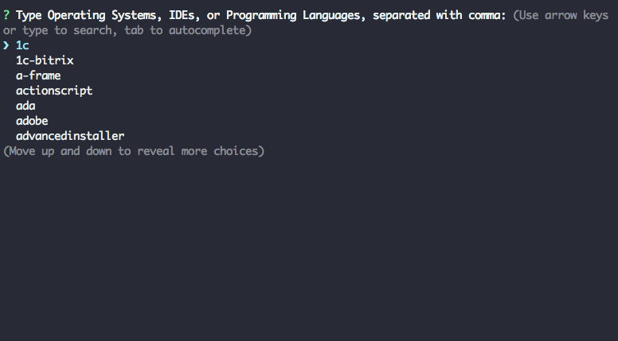

# dotgig

A command-line tool for creating an .gitignore file quickly

## Demo



## Installation

```bash
$ npx dotgig 
# or install it globally 
$ npm install dotgig -g
```

## Usage

Similiar to [gitignore.io](https://www.gitignore.io/), just type any Operating Systems, IDEs, or Programming Languages you want, make sure separated them with comma, for example: `macos,node`. If you do not provide any input, an empty `.gitignore` file will be generated after you pressing enter.

The autocomplete will always be on for better user experience. Simply use arrow key to move up/down to check the type you are looking for, use `tab` to autocomplete once you choose the hint you selected

## Note
I personally modified the [inquirer-autocomplete-prompt](https://github.com/mokkabonna/inquirer-autocomplete-prompt) this lib for my project, just slightly added 4 lines of code inside the `onKeypress` function. 

```javascript
if (this.rl.line.includes(',')) {
  var idxOfLastComma = this.rl.line.lastIndexOf(',')  
  var oldInput = this.rl.line.slice(0, idxOfLastComma+1)
  autoCompleted = oldInput + autoCompleted
}
```

This is only for my project's suitable autocomplete behaviour.